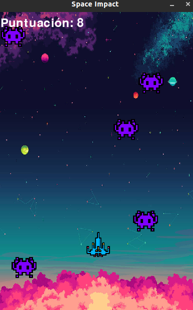

# Space Impact

Space Impact es un juego de estilo arcade desarrollado en Python con Pygame.

## Descripción del juego

En Space Impact, el jugador controla una nave espacial y debe derrotar a una horda de enemigos mientras los esquiva. El objetivo es conseguir la mayor puntuación posible antes de que la nave sea destruida por los enemigos.



## Instalación

1. Clona este repositorio en tu máquina local:

   ```bash
   git clone https://github.com/jaserleney/space-impact.git
   ```

2. Instala las dependencias necesarias:

   ```bash
   pip install pygame
   ```

3. Ejecuta el juego:

   ```bash
   python main.py
   ```

## Controles

- Flechas izquierda/derecha: Mover la nave hacia la izquierda/derecha.
- Flechas arriba/abajo: Mover la nave hacia arriba/abajo.
- Barra espaciadora: Disparar.

## Características

- Gráficos y sonidos retro.
- Puntuación basada en la cantidad de enemigos derrotados.
